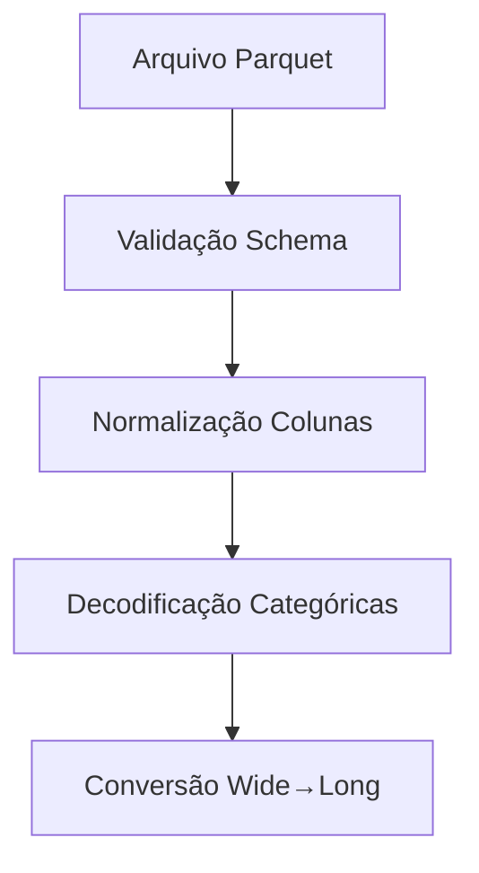

# Documentação Avançada: Indicadores Demográficos e Fluxo do App

## Visão Geral

Esta documentação detalha a implementação de indicadores demográficos no sistema SensoCenso, baseado nos dados do Censo 2022 do IBGE. O sistema foi projetado para fornecer análises populacionais robustas com funcionalidade dual-source (Parquet local e MotherDuck).

## Estrutura Mínima dos Dados e Padronizações

### Formato de Entrada Esperado

O sistema aceita dados em formato **wide** (original do IBGE) e automaticamente converte para formato **long** para análises:

**Formato Wide (entrada):**
- Colunas geográficas: `CD_SETOR`, `CD_MUN`, `NM_MUN`, `CD_UF`, `NM_UF`
- Colunas demográficas: `CD_SITUACAO`, `CD_TIPO`, `V0001-V0007`
- Colunas etárias: `Sexo masculino, 0 a 4 anos`, `Sexo feminino, 0 a 4 anos`, etc.

**Formato Long (processamento):**
```
CD_SETOR | CD_MUN | NM_MUN | idade_grupo | sexo | valor
350010505| 3500105| Adamantina | 0 a 4 anos | Masculino | 1250
350010505| 3500105| Adamantina | 0 a 4 anos | Feminino  | 1180
```

### Padronizações Aplicadas

1. **Normalização de códigos geográficos**: Remoção de zeros à esquerda e caracteres especiais
2. **Decodificação automática**: CD_SITUACAO ↔ SITUACAO_DET_TXT usando `SITUACAO_DET_MAP`
3. **Classificação macro**: Urbana (códigos 1,2,3) vs Rural (demais)
4. **Validação de tipos**: V000* convertidas para numérico com tratamento de erros

## Fórmulas e Variantes dos Indicadores

### Razões de Dependência

```python
# Razão de Dependência Total (%)
RDT = (pop_0_14 + pop_65p) / pop_15_64 * 100

# Razão de Dependência Jovem (%)
RDJ = pop_0_14 / pop_15_64 * 100

# Razão de Dependência de Idosos (%)
RDI = pop_65p / pop_15_64 * 100

# Old Age Dependency Ratio (%)
OADR = pop_65p / pop_20_64 * 100

# Potential Support Ratio
PSR = pop_20_64 / pop_65p
```

### Indicadores de Envelhecimento

```python
# Índice de Envelhecimento 60+ (%)
IE_60p = pop_60p / pop_0_14 * 100

# Índice de Envelhecimento 65+ (%)
IE_65p = pop_65p / pop_0_14 * 100

# Proporção de Idosos Longevos (%)
Prop_80p = pop_80p / pop_total * 100
```

### Proxy de Natalidade

```python
# Taxa Bruta de Natalidade (proxy, ‰)
TBN_proxy = pop_idade0 / pop_total * 1000
```

## Pipeline de Implementação

### 1. Carregamento e Validação


### 2. Processamento de Filtros
```python
# Sequência de aplicação de filtros
1. Situação Urbana/Rural (padrão: Urbana)
2. Tipo de Setor (padrão: 0,1)
3. RM/AU (se disponível)
4. Agregação por nível selecionado
```

### 3. Cálculo de Indicadores
```python
# Pipeline de cálculo
df_long → convert_age_groups_to_individual_ages() → 
calcular_populacoes_agrupadas() → 
calcular_indicadores_demograficos() → 
gerar_flags_qualidade()
```

## Leituras Técnicas e Faixas de Referência

### Interpretação dos Indicadores

| Indicador | Valor Baixo | Valor Médio | Valor Alto | Interpretação |
|-----------|-------------|-------------|------------|---------------|
| RDT | < 45% | 45-65% | > 65% | Pressão demográfica sobre população ativa |
| RDJ | < 25% | 25-40% | > 40% | Pressão da população jovem |
| RDI | < 15% | 15-25% | > 25% | Pressão da população idosa |
| IE_65p | < 30% | 30-70% | > 70% | Nível de envelhecimento populacional |
| PSR | > 10 | 5-10 | < 5 | Capacidade de apoio aos idosos |

### Flags de Qualidade

- **denominador_pequeno**: Pop. 15-64 < 500 → Indicadores instáveis
- Futuros: age_heaping, consistência intercensitária

## Implicações para Políticas Públicas

### 1. Planejamento de Serviços de Saúde
- **RDI alto**: Necessidade de serviços geriátricos
- **RDJ alto**: Demanda por pediatria e educação
- **Prop_80p alta**: Cuidados de longa duração

### 2. Previdência e Assistência Social
- **PSR baixo**: Pressão no sistema previdenciário
- **IE_65p crescente**: Planejamento de benefícios

### 3. Infraestrutura Urbana
- **Situação Urbana + RDT alta**: Demanda por transporte público
- **Tipo de Setor 1 (favelas)**: Necessidades especiais de urbanização

## Métodos Avançados

### 1. Projeções Demográficas
```python
# Método Leslie Matrix (implementação futura)
def projetar_populacao(df_base, anos_projecao, taxa_fecundidade, taxa_mortalidade):
    """Projeta população usando matriz de Leslie"""
    pass
```

### 2. Análise de Cluster Demográfico
```python
# Tipologia de municípios por perfil etário
def classificar_perfil_demografico(indicadores):
    """
    Jovem: RDJ > 40, IE_65p < 30
    Intermediário: Valores médios
    Envelhecido: RDI > 25, IE_65p > 70
    """
    pass
```

### 3. Integração Espacial
```python
# Autocorrelação espacial (Moran's I)
def calcular_autocorrelacao_espacial(gdf, indicador):
    """Identifica clusters espaciais de envelhecimento"""
    pass
```

## Integração ao Pipeline

### Gatilhos Operacionais

1. **Atualização de Dados**: Sistema monitora novos arquivos Parquet
2. **Recálculo Automático**: Cache invalidado quando detectadas mudanças
3. **Alertas de Qualidade**: Notificações para denominadores pequenos
4. **Backup Incremental**: Versionamento de indicadores calculados

### API de Integração
```python
# Endpoint REST para integração externa
POST /api/indicadores/calcular
{
    "nivel": "municipio",
    "codigo": 3500105,
    "filtros": {
        "situacao": ["Urbana"],
        "tipo_setor": [0, 1]
    }
}
```

## Exemplos de Entregáveis Práticos

### 1. Relatório Executivo Municipal
```markdown
# Município: Adamantina (3500105)

## Resumo Demográfico
- População Total: 35.542 habitantes
- RDT: 52.3% (Moderado)
- IE_65p: 84.2% (Alto envelhecimento)

## Recomendações
1. Investir em serviços geriátricos
2. Monitorar sustentabilidade previdenciária local
3. Adaptar infraestrutura para idosos
```

### 2. Dashboard Regional RM/AU
```python
# Comparativo de RMs paulistas
rm_comparison = {
    "RMSP": {"RDT": 48.2, "IE_65p": 62.1},
    "RMC": {"RDT": 51.7, "IE_65p": 58.9},
    "RMBS": {"RDT": 53.1, "IE_65p": 71.4}
}
```

### 3. Série Temporal
```python
# Evolução 2010-2022 (quando disponível)
evolucao_sp = {
    2010: {"RDT": 45.1, "IE_65p": 42.8},
    2022: {"RDT": 49.7, "IE_65p": 67.3}
}
# Tendência: Aceleração do envelhecimento
```

## Arquivos de Referência

### 1. Guia_Indicadores_Demograficos_IBGE2022.xlsx
Planilha contendo:
- Definições detalhadas de cada indicador
- Fórmulas com exemplos numéricos
- Benchmarks internacionais
- Metodologia de cálculo do IBGE

### 2. schema_entrada_idade_simples.csv
Esquema de dados esperado:
```csv
campo,tipo,descricao,obrigatorio
CD_SETOR,int64,Código do setor censitário,sim
idade,int,Idade em anos simples (0-100+),sim
sexo,str,Masculino/Feminino,sim
pop,float,População da célula idade-sexo,sim
```

## Versionamento e Controle de Qualidade

- **Versão atual**: 2.0
- **Última atualização**: 2024
- **Responsável técnico**: Equipe SensoCenso
- **Validação**: Comparação com IBGE Cidades

---

*Esta documentação é viva e será atualizada conforme evoluções metodológicas e requisitos dos usuários.*